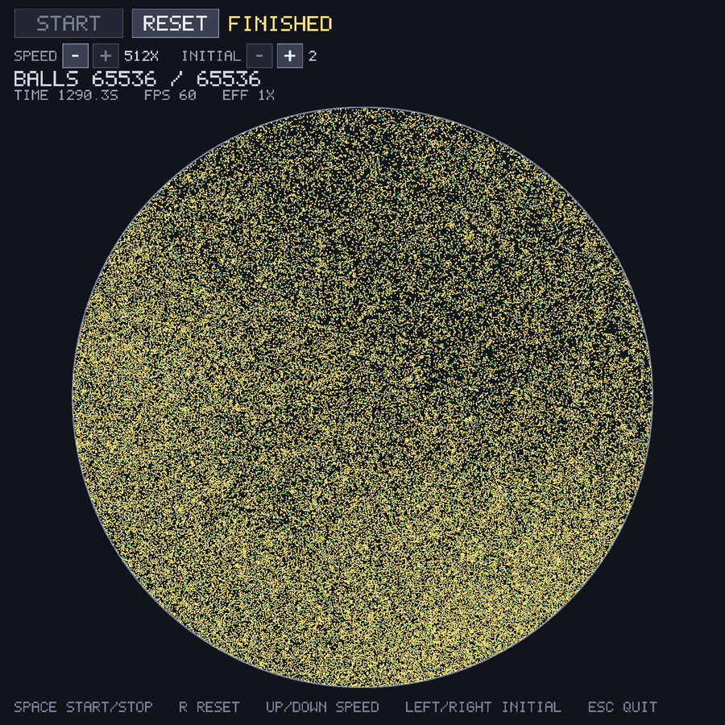
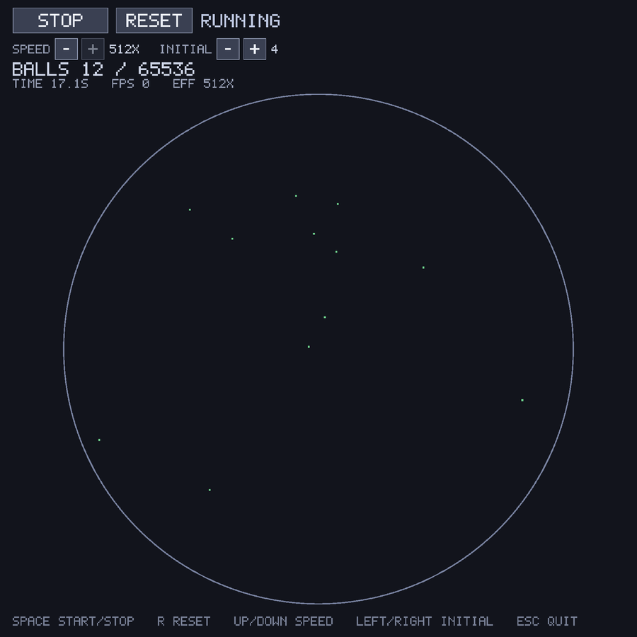
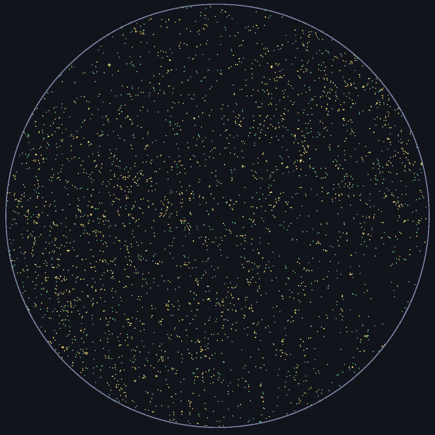
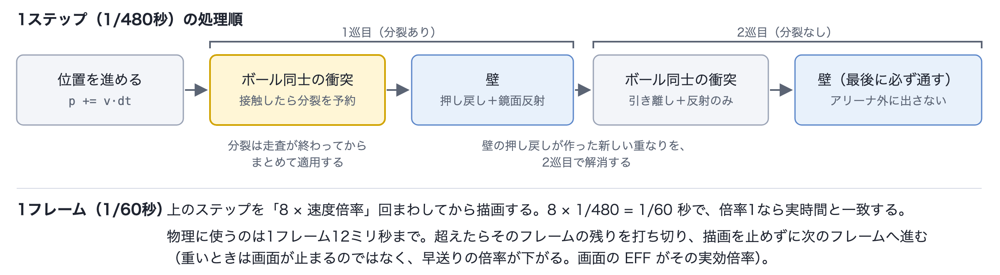
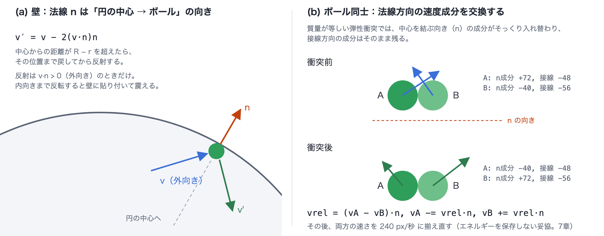
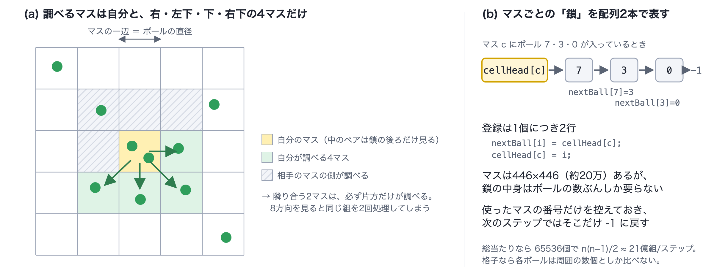

<h1 align="center">Ball Split — 分裂ボール・シミュレーション（C++ / SDL2）<br>作品説明資料</h1>

円形のアリーナの中で2個のボールが動き回り、**ぶつかるたびに両方が2個に分裂して、2 → 4 → 8 … と 2<sup>16</sup> = 65536 個まで増えていく**2Dシミュレーションである。衝突判定・分裂・空間分割はすべて自作で、ゲームエンジンや物理ライブラリは使っていない。

| 項目 | 内容 |
|---|---|
| 氏名 | 木村 大暉 |
| 区分 | 個人制作（Windows 向けデスクトップアプリ／C++） |
| ソースコード | https://github.com/mocaluna0117/ball-split |
| 実行ファイル（bin） | https://github.com/mocaluna0117/ball-split/releases/tag/v1.0 （`BallSplit-windows-x64.zip`） |
| 動作紹介動画 | https://github.com/mocaluna0117/ball-split/blob/main/docs/portfolio/ballsplit-demo.mp4（約41秒） |

<p align="center">
  
</p>
<p align="center"><sub>65536個に達して停止した画面（macOS で撮影）</sub></p>

---

## 1. 制作意図

X（旧Twitter）でよく見かける「円の中のボールが、ぶつかるたびに分裂して増えていく」シミュレーションの動画を、**勉強のために自分でも作ってみた**のがきっかけである。見るだけなら単純だが、自分で作るとなると、衝突の判定・反射・分裂をどう書くか、数が増えたときにどう速さを保つかが分からなかった。C++ とリアルタイム処理、当たり判定の基礎を、手を動かして身につけることを目的にした。

題材はシンプルだが、ボールが増えるほど**当たり判定の量が爆発する**。2個のうちは総当たりで足りるが、65536個では1ステップに調べる組が約21億（n(n−1)/2）になり、そのままではまったく動かない。そこでこの作品では、次の3つを詰めることにした。

- **数が桁違いに増えても、処理落ちせずに最後まで動き切ること**（実行性能）
- **6万個が密集しても、すり抜け・めり込み・壁の外への飛び出しが起きないこと**（当たり判定の品質）
- **「正しく動いた」を目で見るだけでなく、数値で確かめられること**（検証）

---

## 2. 開発概要（提出要項の必須項目）

| 項目 | 内容 |
|---|---|
| **開発期間** | 1日（2026年9月16日）。その後、Windows 実機での動作確認を行った |
| **所要時間（概算）** | 約9時間（AIとの作業記録の開始〜終了時刻、9月16日 1:10〜10:16 から算出） |
| **開発メンバー数・構成** | 1名（AIコーディングエージェント Claude Code を使用。分担は「9. AI利用箇所の明記」） |
| **自身の担当範囲** | 題材と仕様の決定、物理の中核部分（壁の反射・ボール同士の衝突・分裂・空間分割の鎖構造）のコーディング、Windows 実機での動作確認と測定。残りの実装は AI が行った（詳細は9章） |
| **動作環境** | Windows 11（64ビット）で動作確認済み。単体の exe で、Windows 標準以外の DLL は不要。macOS（Apple M2）でも動作する |
| **操作方法** | Space で開始・一時停止、R でリセット、↑↓ で速度（1〜512倍）、←→ で初期個数（2〜8192個）、Esc で終了。画面上のボタンでも同じ操作ができる（詳しくは3章） |
| **制作意図** | 1章のとおり。指数的に増える題材で、実行性能と当たり判定の品質を詰める |
| **規模** | C++ 約990行（`src/` の4ファイル: main.cpp 427行・Simulation.cpp 362行・Simulation.h 81行・Font.h 123行）。コミット1件 |

### 使用ライブラリ・ツール

| 種類 | 名前・バージョン | 用途 |
|---|---|---|
| ライブラリ | **SDL2 2.32.10**（zlib License） | ウィンドウの作成、キー・マウス入力、矩形の描画（Windows では Direct3D 経由）、高精度タイマー |
| 標準ライブラリ | C++17 標準ライブラリ | `std::vector`、`<random>`（メルセンヌ・ツイスタ）、`<chrono>` |
| ゲームエンジン | **使用していない** | — |
| 物理・フォントのライブラリ | **使用していない** | 衝突・分裂・空間分割は自作。文字は 5×7 のビットマップフォントをコード内に持ち、ドットを矩形として描く |
| コンパイラ | MinGW-w64 GCC 16.2.0（Windows 用 exe を macOS からクロスビルド）／Apple clang 21.0.0（macOS） | — |
| ビルド | Makefile（macOS）、CMake 3.20 以上（Visual Studio / vcpkg 用）、`build_windows.sh`（クロスビルド） | — |

---

## 3. 動作環境・操作方法・実行方法

### 実行方法（Windows）

1. Releases から `BallSplit-windows-x64.zip` を落として展開する
2. `ballsim.exe` をダブルクリックする（DLL・インストールは不要）
3. 万一起動しない場合は、`fallback` フォルダの `ballsim.exe`（`SDL2.dll` と同じ場所に置く）を実行する

`ballsim.exe` は SDL2 も C++ ランタイムも exe の中に取り込んであり、依存するのは KERNEL32・USER32・GDI32 や UCRT（`api-ms-win-crt-*`）など、Windows に標準で入っている DLL だけである（`objdump` で確認）。約2.7MB。

<p align="center">
  
  
</p>
<p align="center"><sub>左: 起動直後（READY） ／ 右: 連鎖の途中（3,326個）。黄色は分裂して0.25秒以内のボール</sub></p>

### 操作方法

| キー | 画面のボタン | 内容 |
|---|---|---|
| Space | START / STOP | 開始・一時停止 |
| R | RESET | いまの初期個数で配置し直し、開始前の状態に戻す |
| ↑ / ↓ | SPEED の + / − | シミュレーション速度を 1〜512倍 の範囲で2倍・半分にする（起動時は16倍） |
| → / ← | INITIAL の + / − | 初期個数を 2〜8192個 の範囲で2倍・半分にし、すぐ配置し直す |
| Esc | — | 終了 |

- 画面上部に、状態（READY / RUNNING / PAUSED / FINISHED）・ボール数・経過時間・FPS・実効倍率（EFF）を出す。画面下部には操作の一覧を常に表示している
- 初期個数が2個のときは、最初の接触まで時間がかかる（シミュレーション内で数分）。速度を上げるか初期個数を増やすと、すぐに連鎖が始まる

### コマンドラインのオプション

```
ballsim.exe --initial 256                 初期個数を指定して起動
ballsim.exe --headless                    画面を出さずに最後まで回し、到達時間と検証結果を出す（6章）
ballsim.exe --headless --initial 4096     初期個数を変えて検証
ballsim.exe --shot out.bmp                上限到達時の1フレームを画像に保存して終了（資料用）
ballsim.exe --shot out.bmp --shot-at 30   30フレーム目を保存
```

Windows ではウィンドウアプリとして作ってあるので、ダブルクリックしてもコンソールは開かない。`--headless` をコマンドプロンプトや PowerShell から実行したときだけ、呼び出し元の画面に結果を出す（その場合、プロンプトが先に戻り、結果がその後に表示される）。

---

## 4. 仕組み

### 1ステップの流れ

<p align="center">
  
</p>

- **固定の時間刻み（1/480秒）** で進める。描画のフレームレートに物理の結果が左右されない
- 衝突と壁を**2巡**する。壁の押し戻しはボールを内側へ動かすので、そこで新しい重なりができる。1巡で終えるとそれが直されないまま画面に出る
- **壁を最後に置く**ことで、どの経路を通ってもアリーナの外に出ないことを保証している

### 壁とボール同士の衝突

<p align="center">
  
</p>

- **壁**: 円の壁の法線は「中心からボールへの向き」なので、別に計算しなくてよい。中心からの距離が R − r を超えたらその位置まで戻し、`v′ = v − 2(v·n)n` で反射する
- **ボール同士**: 中心間の距離が直径より近ければ接触とする。めり込み量を半分ずつ分け合って引き離し、法線方向の速度成分を交換する

### 分裂

- 接触した2個が**どちらも分裂の猶予（0.25秒）が切れていて**、上限に余裕があれば、両方を分裂させる
- 親の位置から、ランダムな向きの軸に沿って ±r ずらした所に子を2個置き、それぞれにランダムな向きの速度を与える
- 親の場所を子1で上書きし、子2だけを配列の末尾に足す。**配列から要素を消す処理が一度も起きない**
- 子は生まれてから0.25秒は分裂しない（分裂したての黄色）。これが無いと、生まれた瞬間に隣の子と接触して連鎖し、一瞬で上限に達してしまう

### 空間分割

<p align="center">
  
</p>

- 空間を**ボールの直径と同じ幅のマス目**（446×446）に区切る。接触しうる相手は自分のマスと周囲8マスにしかいない
- 周囲8マスのうち**右・左下・下・右下の4マスだけ**を調べる。隣り合う2マスのどちらか片方だけが相手を調べる形になり、同じ組を2回処理しない
- マスへの登録は `cellHead`（マスごとの先頭）と `nextBall`（次のボール）の**配列2本で鎖を作る**方式にした。約20万マスあってもメモリはボールの数ぶんで足りる
- ボールが入っているマスの番号を控えておき、次のステップではそこだけ空に戻す。約20万マスを毎回すべて初期化する無駄を省いている

### 描画

- 65536個のボールを矩形の配列にまとめ、`SDL_RenderFillRectsF` で**通常色と分裂直後の色の2回の呼び出し**で描く
- 画面は論理座標 1000×1000 で描き、SDL に実際のウィンドウの大きさへ拡大・縮小させる。ウィンドウは 900×900。高解像度の画面でも座標の計算は変わらない

---

## 5. 技術的に工夫した点

選考のポイントの観点ごとに、この作品での根拠を示す。

### (1) 実行性能 — 処理落ちさせない仕組み ⚡

- **総当たり O(n²) を、近くのマスだけの探索に下げた。** 65536個で約21億組/ステップだった比較が、各ボールにつき周囲のマスにいる数個だけになる。ボールがほぼ均一に散らばる限り、手間はボールの数にほぼ比例する
- **1フレームの物理計算に上限（12ミリ秒）を設けた。** 1/60秒のうち12ミリ秒を超えたら、そのフレームの物理を打ち切って描画に進む。重くなると**画面が止まる（処理落ち）のではなく、早送りの倍率が下がる**。実効倍率は画面の EFF に出る
- **余計な計算・確保をしない。** 接触の判定は距離の2乗どうしで比べ、平方根は接触していた組にだけ使う。ボール・格子の配列は開始時に上限ぶん確保し、実行中に確保し直さない。描画の呼び出しはボールの数に関係なく2回で済む
- **ロード時間が無い。** 画像・音声・フォントのファイルを読み込まない（文字もコード内のビットマップ）ので、起動してすぐに操作できる
- **描画は60fpsを保つ。** macOS（Apple M2）の録画では、5万個を超えて物理を回している間も FPS 60 の表示を保った（6章）
- **実測**（6章）: Windows 11 の PC（Intel Core i5-1335U）で、65536個のときの1ステップは **7.24ミリ秒**。画面なしの検証モードでは、シミュレーション内の234秒ぶん（112,347ステップ）を**実時間1.11秒**で回し切った

### (2) 当たり判定の品質 — すり抜け・めり込み・飛び出しを防ぐ 🎯

- **すり抜けない時間刻みを計算で決めた。** 2個が正面から近づくときの相対速度は最大 240×2 = 480 px/秒。時間刻み1/480秒なら、1ステップで縮まる距離は最大1pxで、ボールの直径1.8pxより小さい。刻みを1/240秒にしていた段階では、1ステップの移動量が直径に近く、接触の解決が追いつかなかった
- **解決の順番で飛び出しとめり込みを防いだ。** 衝突 → 壁 → 衝突 → 壁 の2巡にし、壁を最後に置いた（4章）。最初の実装では、65536個に達した時点で重なりが直径の86%残っていたが、この2巡と刻みの見直しで、画面上で1ピクセル未満になった
- **壁に貼り付かない。** 反射は外向きに動いている（v·n > 0）ときだけ行う。押し戻した直後に内向きの速度まで反転させると、壁際で震え続けるため
- **ループ中に配列を伸ばさない。** 分裂をその場で行うと、`std::vector` の再確保で持っている参照が無効になり、走査中の要素数も変わってループが壊れる。分裂は番号だけ記録し、**走査が終わってからまとめて適用**している
- **範囲外に触らない。** 衝突の解決は壁より前に走るので、ボールがわずかに外へはみ出していることがある。マスの番号は必ず格子の範囲に押し込めてから配列を引く。2個の中心が完全に重なった場合（距離0で割れない）の逃げ道も用意した

### (3) 品質管理 — メモリと後片付け 🧹

- **メモリは `std::vector` だけで管理し、`new` / `delete` を書いていない。** SDL のウィンドウ・レンダラーは、正常終了でも初期化失敗の途中でも、作った逆の順で破棄している
- **リークと未定義動作を道具で検査した。** macOS の `leaks` で、起動 → 65536個まで実行 → 終了までを調べた。報告は macOS の内部フレームワーク（AppIntents）の1件だけで、**本作品のコード・SDL2 からのリークは検出されなかった**。AddressSanitizer と UndefinedBehaviorSanitizer を有効にしたビルドで検証モードを最後まで回し、**エラー0件で合格**した
- **状態遷移と後片付け。** 状態は READY → RUNNING ⇄ PAUSED → FINISHED の4つ。リセットと初期個数の変更は、ボール・格子・経過時間をすべて初期化してから READY に戻す。FINISHED では START ボタンを無効にし、倍率・個数が上限・下限に達した +/− ボタンは灰色で示して、それ以上値が変わらないようにした

### (4) ユーザー意識・作り込み 🧑‍💻

- **操作が画面の中で完結する。** キーとボタンの両方で同じ操作ができ、画面下部に操作の一覧を常に出している
- **何が起きているかが見える。** 分裂したてのボールを黄色にし、連鎖がどこで起きているかを色で示した。ボール数・経過時間・FPS・実効倍率を常に表示している
- **序盤も見える。** 実寸（半径0.9px）では数個のうちは点にしか見えないので、個数が約30個を下回る間だけ、**表示上の**半径を大きくしている（当たり判定は変えない）
- **待たせない。** 初期2個では最初の接触まで数分かかるので、速度倍率（最大512倍）と初期個数の変更で、すぐに見どころへ進めるようにした
- **配布のしやすさ。** exe 1個で動くようにし、起動しない環境向けに DLL を分けた予備も同梱した
- **環境の違いに対処した。** macOS では正しく描けていたアリーナの円が、Windows（Direct3D）では下側が欠けた。折れ線の描き方がバックエンドごとに違うためで、ボールや文字と同じ「矩形の塗りつぶし」で円を描く（小さな正方形を2048個並べる）方式に統一して解決した

### (5) 保守性・可読性 🧩

- **物理と画面を分けた。** `Simulation` クラス（Simulation.h/.cpp）は SDL を一切使わず、画面側（main.cpp）はその結果を読んで描くだけにした。そのため、**同じ物理のコードを画面なしで動かして検証できる**（6章の検証モード）
- **定数を1か所に集めた。** アリーナの大きさ・半径・速さ・時間刻み・上限は Simulation.h にまとめ、マスの大きさや格子の数は半径から計算で決まるようにした。半径を変えても格子は自動で追従する
- **同じ処理を1つの関数にまとめた。** 1組のボールの判定・反射・分裂の予約は `testPair` 1つで行い、同じマスの中の組と隣のマスとの組の両方から呼ぶ
- **コメントには「何を」より「なぜ」を書いた。** 例: 4方向だけ見る理由、壁を最後に置く理由、ループ中に配列を伸ばさない理由
- 扱う物体が「ボール」1種類なので、継承（基底クラス）は使っていない。役割ごとにクラスとファイルを分けている。**残っている弱点**（検証用の関数が走査のループを複製している、`main` 関数が長い）は7章に書いた

### (6) 数学・物理の使いどころ 📐

- **円の中に一様に撒く。** 中心からの距離を `R × 乱数` にすると中心付近に偏る。半径 ρ 以内に入る確率は面積に比例して (ρ/R)² なので、逆に解いて **ρ = R√u**（u は0〜1の一様乱数）とすれば一様になる
- **鏡面反射。** 速度 v を、法線 n の方向の成分 (v·n)n と残りに分け、法線成分だけを反転させる。v − (v·n)n − (v·n)n = **v − 2(v·n)n**
- **等しい質量の弾性衝突。** 運動量と運動エネルギーの両方を保存する1次元の衝突を解くと、質量が等しいときは**2個の速度がそっくり入れ替わる**。摩擦を考えないので接線方向は変わらず、法線方向の成分だけを交換すればよい
- **平方根を避ける。** 距離はどちらも0以上なので、2乗しても大小関係は変わらない。`dx² + dy² < (2r)²` で判定できる
- **規模の見積もり。** 65536個のボールの面積の合計はアリーナの約33%（65536 × 0.9² ÷ 400²）。この密度と時間刻みで、重なりが画面上で見えない大きさに収まるかを、6章の検証で確かめた

---

## 6. 検証の方法と結果

### 方法

`--headless` を付けて起動すると、画面を出さずに上限まで回し、次を自動で判定する。

- 65536個に到達したか
- アリーナの外に出たボールが0個か
- 最も深い重なりが **1.0 論理px 未満**か

重なりの基準を「直径の何%」ではなく絶対値にしたのは、意味があるのは**画面上で見えるかどうか**だからである。論理1000pxを900pxのウィンドウに描くので、1.0論理pxは実画面の0.9ピクセルに当たる。つまり「1ピクセルもずれて見えない」が基準の意味である。

最初は基準を0.5pxにしていたが、繰り返し測ると16回に1回ほど超えることが分かった。最も深い重なりは65536個の中の最悪値なので、実行ごとに揺れる。測った範囲に対して余裕のある値に取り直した。

### 結果

| 環境 | 実行回数 | 到達数 | 外に出た数 | 重なった組 ※1 | 最も深い重なり | 1ステップ ※2 |
|---|---|---|---|---|---|---|
| macOS（Apple M2） | 16回 | 全回 65536 | 全回 0 | 4〜8% | 0.21〜0.55 px<br>（中央値 約0.30） | 約8 ms |
| macOS（Apple M2）再実行 ※3 | 5回 | 全回 65536 | 全回 0 | 3.4〜5.8% | 0.26〜0.33 px | — |
| **Windows 11**<br>（Core i5-1335U） | 1回 | 65536 | 0 | 6.2% | 0.27 px | **7.24 ms** |

※1 重なっている組の数を、ボールの数で割った割合（Windows では 4,049組）。

※2 65536個に達した状態での、1ステップにかかる実時間。

※3 2026年9月29日に再実行（初期個数2で3回、256・4096で各1回）。このときの Mac はバッテリー駆動で他の処理の負荷が高く、時間の値は参考にならないため載せない。

- 初期個数を 2 / 256 / 4096 に変えても、すべて上限まで到達した
- Windows 11 での実行結果（抜粋）:

```
PS> .\Desktop\ballsim.exe --headless
ball radius 0.90   initial balls 2   max balls 65536   grid 446 x 446

     balls    sim time(s)      wall(s)          steps
         2           0.00         0.00              1
         4         175.47         0.01          84159
       ...（途中の行を省略）
      1026         231.85         0.09         111131
     65536         234.39         1.11         112347

--- result ---
balls            : 65536
time per step    : 7.240 ms  (138.1 steps/sec)
outside arena    : 0
overlapping pairs: 4049  (6.2% of balls)
deepest overlap  : 0.2685 px  (14.9% of diameter)
verdict          : PASS  (limit 1.00 px)
```

- 品質管理の検査（5章(3)）: macOS の `leaks` で本作品由来のリーク0件。AddressSanitizer + UndefinedBehaviorSanitizer 付きのビルドで検証モードがエラー0件・PASS
- Windows 11 の実機で、単体版の `ballsim.exe` をダブルクリックして起動し、操作できることを確認した。検証モードでも上のとおり PASS した。Windows 11 上でソースからのビルドが通ることも確認した
- 動作紹介動画は macOS（Apple M2）で録画した。初期4個・速度2〜4倍で始め、65536個で停止するまでを収めている。画面の表示では、35,170個・55,870個で物理を回している間も、65536個に達した後も **FPS 60** を保っていた（実効倍率 EFF は 1X に下がる）

---

## 7. 残っている妥協点と、次に直すなら

| 妥協点 | なぜその妥協を選んだか | 次に直すなら |
|---|---|---|
| **衝突のたびに速さを240 px/秒に揃え直している**（エネルギーを保存しない） | 弾性衝突だけでは速さがばらつき、遅いボールが次の接触を起こせず、連鎖が失速する。「見た目の一貫性」と「上限まで増えきること」を物理の正しさより優先した | 保存則を守ったまま連鎖を保つなら、アリーナの外から一定のエネルギーを与える仕組み（温度を一定に保つ方法など）を入れて比べる |
| **重なりが完全にはゼロにならない**（最大 約0.2〜0.55 px） | 解決の反復回数を増やせば減るが、その分だけ遅くなる。画面で見えない大きさ（1ピクセル未満）に収まったので、そこで止めた | 重なりが残った組だけを追加で解く。反復の回数を増やしたときの時間と重なりの関係を測って決める |
| **65536個に近づくと実時間より遅くなる** | Windows で1ステップ7.24ミリ秒に対し、実時間で進めるには2.08ミリ秒（1/480秒）以内が要る。つまり約0.29倍の速さになる。処理落ちさせない仕組み（5章(1)）で、画面は止めずに倍率を下げている | ボールの配列をマスの順に並べ替え、メモリを連続して読めるようにする（キャッシュ効率）。格子の走査を複数のスレッドに分ける |
| **画面の EFF が「1X」より下を表示しない** | 実効倍率を整数に切り捨てて、下限を1にしているため。上限付近では実際は1倍を下回っている | 小数で表示する |
| **ボールを正方形で描いている** | 65536個の円を描くと描画の負荷が大きい。直径1.8pxでは円と正方形の差がほぼ見えない | 小さな円の画像（テクスチャ）を並べて描く |
| **乱数の種を固定できない** | 起動ごとに違う結果になるので、同じ現象の再現ができない | `--seed` を足し、同じ種なら同じ結果になるようにする（不具合の再現・自動テスト用） |
| **検証用の関数が走査のループを複製している** | 衝突の走査と検証の走査が同じ形で、コードが2か所にある | 「近くの組ごとに関数を呼ぶ」部分を1つのテンプレート関数にまとめる |
| **`main` 関数が長い**（約280行）、走査のループが4重 | 期限内に完成させることを優先した | 入力・更新・描画を別の関数（またはクラス）に分ける。1マスぶんの処理を関数に切り出してネストを浅くする |
| **Windows 10 での動作は未確認** | 手元の Windows 機は Windows 11 のみ | Windows 10 の環境で起動と検証モードを確認する |

---

## 8. ゲーム開発のプログラマとして活かせると考える点

- **リアルタイム処理の性能設計。** 「1フレームに使える時間」から逆算して、固定の時間刻み、1フレームあたりの物理計算の上限、描画の呼び出し数の削減を組み合わせた。重くなったときの落ち方（止まるのではなく早送りが遅くなる）まで決めておく考え方は、処理落ちを避けるゲームのメインループでも同じだと考えている
- **当たり判定を「広い段階」と「細かい段階」に分けて作った経験。** 一様格子で候補を絞ってから、2個の円の判定と応答をする構成は、ゲームの当たり判定の基本形（ブロードフェーズとナローフェーズ）と同じである。すり抜けない時間刻みの計算、解決の順番による飛び出しの防止、走査中に要素を増やさない設計（生成を後でまとめて行う）も、敵や弾を大量に出すゲームにそのまま通じる
- **数学・物理を、式の意味から使い分けられること。** 鏡面反射、等質量の弾性衝突、一様な乱数の撒き方、平方根を避ける比較など、どれも式を導いた上で、必要な所にだけ使っている。エネルギーを保存しない揃え直しのように、「物理として正しいこと」と「見せたいもの」がぶつかる所で、理由を持って選べる
- **動いているように見える、で終わらせない検証。** 画面を出さずに回して、到達数・飛び出し・重なりの深さを自動で判定する仕組みを作り、実行ごとの揺れまで見て基準を決めた。リーク検査やサニタイザも使った。ゲームのバグは再現しにくいものが多いので、数値で確かめる仕組みを先に作る姿勢は役に立つと考えている
- **環境の違いを原因まで追うこと。** Windows だけ円が欠ける問題を、描画のバックエンドの違いまで追い、環境による差が入りにくい描き方に揃えて解決した

---

## 9. AI利用箇所の明記

> 提出要項「※AIを利用したアセット・コードが含まれる場合は、利用箇所を具体的に明記してください」に基づく記載である。

### 開発でのAIの利用

本作品の開発では、AIコーディングエージェント **Claude Code（Anthropic）** を使用した。コミット1件のうち1件に、AIが共同作成者として記録されている。コミットが1件しかないため、分担は AI との作業記録（2026年9月16日 1:10〜10:16）をもとに以下に示す。

**前半（1:10〜5:13）: 自分が手で書いた部分。** AIに手順と数式を1ステップずつ解説してもらいながら、次のコードを自分で書いた。

- ウィンドウの表示とメインループの骨組み（SDL の初期化・イベント処理・描画）
- 等速で動かす処理と、円の壁での押し戻し・鏡面反射
- ボール同士の衝突（2乗での判定、めり込みの押し戻し、法線成分の交換、速さの揃え直し）
- 分裂（猶予時間、走査後にまとめて適用する方式、親の上書きと子の追加）
- 一様格子の鎖構造（`cellHead` / `nextBall`）と4方向の走査（組み込みの途中まで）

**後半（5:13〜）: AIが書いた部分。** 時間が足りなくなったため、残りの実装をAIに依頼した。AIは全ファイルを完成版として書き直し、次を実装した。前半で自分が書いた衝突・壁・分裂の処理内容は、書き直し後もほぼそのまま残っている。

- 格子の仕上げ（使ったマスだけを戻す仕組み、総当たりの除去）、衝突と壁の2巡、初期配置（平方根による一様な撒き方・個数に応じた範囲・初期の猶予）
- ボールの半径と時間刻みを、測定しながら決める調整
- 画面まわりのすべて（状態の管理、ボタン、HUD、5×7のビットマップフォント、描画の一括化、1フレームの物理計算の上限）
- 検証モード（`--headless`）と画像の保存（`--shot`）
- Windows 対応（コンソールを開かない構成、Direct3D で円が欠ける問題の回避、クロスビルド）
- `Makefile`、`CMakeLists.txt`、`build_windows.sh`、`make_submission.sh`、`README.md`、`doc/document.md`、コミットメッセージ

**自分が担ったこと:** 題材と仕様の決定（円形のアリーナ、2個から分裂して増える、開始・停止・リセット）、上記の前半のコーディング、Windows 11 の実機での動作確認と測定、動作紹介動画の録画。

### 本資料・動画でのAIの利用

- **本資料の文章と図（4章の3枚）**: Claude Code が、リポジトリのコード・README・作業記録・実測値をもとに下書きし、作成した。内容は自分で確認した
- **画面写真**: Claude Code が macOS 上で `--shot` オプションを使って撮影した
- **品質管理の検査（`leaks`、サニタイザ）と macOS での再測定**: Claude Code が実行した
- **動作紹介動画**: macOS 上で自分が画面を録画し、見出しカードの作成・挿入と圧縮（43.8MB → 16.1MB）を Claude Code が ffmpeg で行った
- 作品の中に、AIで生成した画像・音声などのアセットは含まれていない（アセットを使っていない）

---

## 10. ソースコードの構成とビルド方法

```
ball-split/
├── src/
│   ├── Simulation.h / .cpp   # 物理（移動・衝突・壁・分裂・空間分割・検証）。SDL に依存しない
│   ├── main.cpp              # 画面・入力・HUD・メインループ・コマンドライン
│   └── Font.h                # 5×7 のビットマップフォント
├── CMakeLists.txt            # Visual Studio / vcpkg / 任意の SDL2 の場所に対応
├── Makefile                  # macOS 用
├── build_windows.sh          # macOS から Windows 用 exe をクロスビルド
├── doc/document.md           # 設計資料
├── docs/portfolio/           # 本資料・図・動画
└── shots/                    # 画面写真
```

### Windows（Visual Studio 2022）でビルドする

CMake が Visual Studio のソリューション（`.sln`）を生成する。生成物には生成したPCの絶対パスが入るため、リポジトリには含めず、次の手順で作る。

```
vcpkg install sdl2:x64-windows
cmake -S . -B build -G "Visual Studio 17 2022" -A x64 -DCMAKE_TOOLCHAIN_FILE=<vcpkg>/scripts/buildsystems/vcpkg.cmake
cmake --build build --config Release        # または build/ballsim.sln を Visual Studio で開く
```

vcpkg を使わない場合は、SDL2 の公式配布（`SDL2-devel-2.32.10-VC.zip`）を展開し、`-DSDL2_ROOT=C:/SDL2-2.32.10` を渡す。どちらの場合も `SDL2.dll` は exe の隣に自動でコピーされる。Windows 11 上でビルドが通ることを確認している。

### macOS でビルドする

```
brew install sdl2
make && ./ballsim
```

CMake（`cmake -S . -B build && cmake --build build`）でもビルドできることを確認している。

### 提出した exe の作り方

提出した `ballsim.exe` は、macOS 上で MinGW-w64 を使ってクロスビルドした（`build_windows.sh`）。SDL2 と C++ ランタイムを静的にリンクし、DLL が不要な単体の exe にしている。

---

*本資料は提出用の説明資料である。ソースコードは上記のGitHubリポジトリで全文公開している。*
